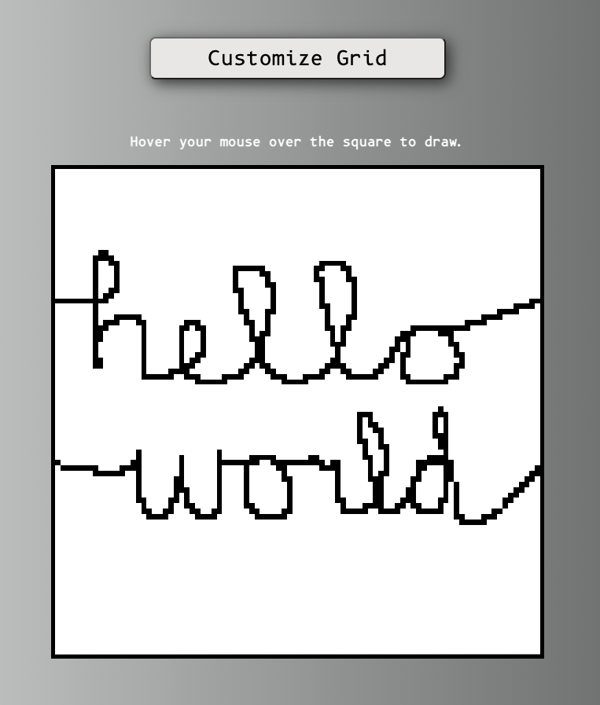

# Etch-a-Sketch

## Description
A sketch pad application that allows users to choose the level of pixelation thereof.  
Users can simply hover their mouse cursors over the sketch pad to fill in the pixels and draw whatever they'd like. 

## Link to Deployed Website
https://robertrish.github.io/etch-a-sketch/

## Technologies Used
HTML, CSS, JavaScript
      
## Screenshot

## Questions
Visit my GitHub page! [RobertRish](https://github.com/RobertRish)
If you have questions feel free to reach out!: robert.rish1225@gmail.com